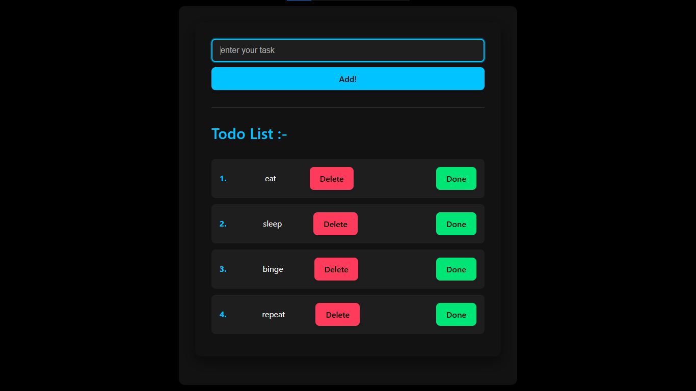

<h1 align="center">React Todo List Application</h1>

  

  A clean, responsive todo list application built with React, featuring dynamic state management, UUID for unique identifiers, and modern JavaScript techniques.

<h2>Features</h2>

<ul>
  <li>Add, delete, and mark tasks as complete</li>
  <li>Unique IDs for each task using UUID</li>
  <li>State management with React Hooks</li>
  <li>Responsive design with clean CSS</li>
  <li>Filter functionality for task management</li>
</ul>

<h2>Technologies Used</h2>

<ul>
  <li>React 19.0.0</li>
  <li>React Hooks (useState)</li>
  <li>UUID v11.1.0 for unique identifiers</li>
  <li>Modern JavaScript (ES6+)</li>
  <li>Vite 6.2.0 as the build tool</li>
</ul>

<h2>Implementation Details</h2>

The application uses several modern React patterns:

<h3>State Management</h3>

<pre><code class="language-jsx">// Managing todos as an array of objects
const [todos, setTodos] = useState([{
  task: "simple-task",
  id: uuidv4(),
  completed: false
}]);

// Input field state
const [inputValue, setInputValue] = useState('');
</code></pre>

<h3>Adding Tasks</h3>

<pre><code class="language-jsx">const addTask = () => {
  setTodos((prevTodos) => {
    return [...prevTodos, {
      task: inputValue,
      id: uuidv4(),
      completed: false
    }];
  });
  setInputValue('');
}
</code></pre>

<h3>Deleting Tasks</h3>

<pre><code class="language-jsx">const deleteTask = (id) => {
  setTodos(todos.filter((task) => task.id !== id));
}
</code></pre>

<h3>Marking Tasks as Complete</h3>

<pre><code class="language-jsx">const toggleComplete = (id) => {
  setTodos((prevTodos) => 
    prevTodos.map((todo) => {
      if(id === todo.id) {
        return {
          ...todo,
          completed: !todo.completed,
        };
      } else {
        return todo;
      }
    })
  );
}
</code></pre>

<h3>Event Handling</h3>

<pre><code class="language-jsx">const handleKeyPress = (e) => {
  if(e.key === "Enter") {
    addTask();
  }
}
</code></pre>

<h2>Learning Journey</h2>

This project was created while learning React fundamentals. Key learning points included:

<ul>
  <li>Working with functional components and hooks</li>
  <li>Managing and updating state</li>
  <li>Handling user input and events</li>
  <li>Using array methods like map and filter</li>
  <li>Implementing the spread operator for immutable updates</li>
  <li>Creating a responsive design with CSS</li>
</ul>

<h2>CSS Styling</h2>

The application features a dark-themed UI with AMOLED black background and electric blue accents, making it visually appealing and easy to use. The responsive design ensures it works well on all device sizes.

<pre><code class="language-css">/* Example of the styling approach */
:root {
  --amoled-black: #000000;
  --electric-blue: #00c3ff;
  --text-color: #ffffff;
}

/* Responsive design elements */
@media (max-width: 600px) {
  #root {
    padding: 1rem;
  }
  
  li {
    flex-direction: column;
    align-items: flex-start;
  }
}
</code></pre>

<h2>Getting Started</h2>

<ol>
  <li>Clone the repository</li>
  <li>Install dependencies with <code>npm install</code></li>
  <li>Run the development server with <code>npm run dev</code></li>
  <li>Build for production with <code>npm run build</code></li>
</ol>

